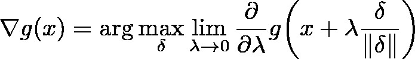

# math2img -- Converting math formula to image offline



## Introduction

This utility converts math formula (in LaTeX) to image of any format that `imagemagick` supports. The implementation is based on [TeX to image over command line](https://tex.stackexchange.com/questions/34054/tex-to-image-over-command-line/34058#34058). The above image is a sample output.

## Dependencies

- `texlive-full`
- `imagemagick`
- `ghostscript`

Installation of dependencies (Debian/Ubuntu):

```bash
sudo apt update
sudo apt install texlive-full imagemagick ghostscript
```

## Installation

```bash
cd "$DIRECTORY_TO_INSTALL"
git clone https://github.com/kkew3/math2img.git
export PATH="$DIRECTORY_TO_INSTALL/math2img:$PATH"
```
## Support for Windows

Might work in Windows 10 WSL but never tested.


## Usage

> Copied from `math2img -h`

```
Usage: math2img [OPTIONS]...

This utility converts LaTeX formula to image by calling `pdflatex' and
`convert' (ImageMagick).  The LaTeX formula may use any commands from
packages `amsmath', `amssymb' and `physics'.

Options:

    -e            returns 0 even if the specified math equation is empty or
                  contains only whitespace characters; if not specified,
                  returns 2
    -f MATHFILE   a file where the math formula is presented; if MATHFILE is
                  specified as "-", then it will be read from /dev/stdin; if
                  the option is not specified, the text editor specified by
                  variable EDITOR will be opened for the user to type the math
                  equation; if EDITOR is not set, it's default to `vi'
    -h            display this help and exit
    -o OUTFILE    the result image file to write; if not specified, write to
                  /dev/stdout in format FORMAT. Not specifying this option
                  implies `-q' and MATHFILE must be specified as a filename;
		  otherwise fails and returns 64
    -q            suppress any stdout/stderr message
    -T FORMAT     the format to use; for a list of supported format, refer to
                  Section "Supported Image Formats" on page
                  https://imagemagick.org/script/formats.php where the Mode
                  column contains 'W'. This option overwrites the filename
                  extension in OUTFILE, if any. When OUTFILE has been
                  specified, there's no default FORMAT; otherwise, the default
                  FORMAT is "PNG"

Return code:

	0             success
	1             command line option parsing error
	2             aborted since the specified math equation is empty or
	              contains only whitespace characters
	4             error raised when reading from MATHFILE
	8             error raised when compiling PDF from LaTeX
	16            error raised when converting PDF to image file
	32            error raised if FORMAT is not supported by ImageMagick
	64            error raised when opening EDITOR
	X             when errno can't be decided precisely, the return code
	              is the bitwise-OR of more than one nonzero return codes
		      defined above

Examples:

	# display 'f(x)' using ImageMagick `display' utility
	echo 'f(x)' | math2img -Tjpeg -f- | display

	# save formula image to "image.png"
	echo 'f(x)' | math2img -o image.png -f-

	# tolerate empty formula; "image.png" won't be written
	echo '' | math2img -eqf- -o image.png

	# open $EDITOR and write the image to "my image" in GIF format
	math2img -Tgif -o "my image"
```


## Known issue

`ImageMagick` may prevent user from reading PDF file.
See detailed explanation of this issue and corresponding solution in [this post](https://stackoverflow.com/a/52661288).


## See also

- [nwtgck/math2img](https://github.com/nwtgck/math2img.git)
